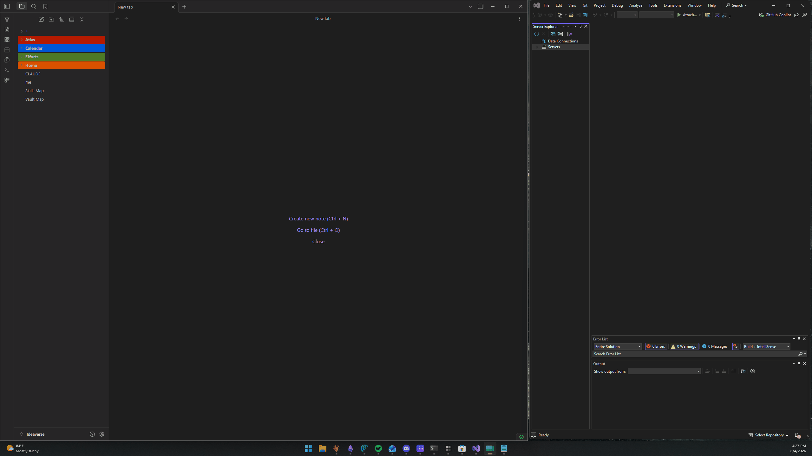
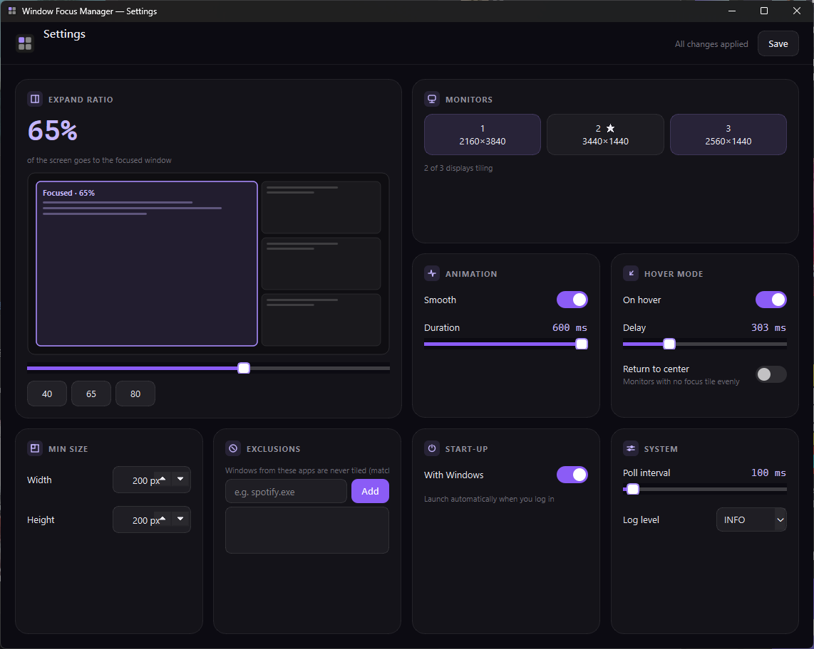

# Windows Focus Manager

A lightweight tiling window manager for Windows that automatically expands your focused window to fill its share of the screen — no keyboard shortcuts required. It lives in the system tray and arranges windows as gap-free tiles whenever you switch focus.

<p align="center">
  
</p>

## Features

- **Click-to-tile** — focus a window and every window on that monitor snaps into contiguous, gap-free tiles; the focused window gets the largest share.
- **Hover mode** *(optional)* — windows tile as your cursor rests on them.
- **Layout presets** — columns, quadrants, triptych or a fixed grid, or let it pick automatically by window count. Windows keep their position; only the shared edges move.
- **Smooth animations** — gap-free transitions with no visible desktop flash mid-animation.
- **Focus outline** *(optional)* — a subtle highlight around the focused window while the app resizes it; colour, opacity and thickness are configurable.
- **Per-monitor** — each monitor tiles independently; landscape splits left/right, portrait splits top/bottom. Layout and expand ratio can be overridden per display.
- **Runs quietly** — reacts to focus changes instantly, recovers on its own if something goes wrong, and refuses to start a second copy.
- **App exclusions** — skip specific windows by title or executable (e.g. Spotify, picture-in-picture).
- **Native settings window** — configure everything from a real desktop window (no browser, no background server).
- **System tray** — Pause/Resume, Open Settings, Exit.
- **Start with Windows** — optional auto-launch at login.
- **No admin rights** — installs per-user with no UAC prompt.

## Requirements

- Windows 10 or 11
- No Python required — the installer bundles everything.

## Installation

1. Download **`WindowFocusManager_Setup.exe`** from the [Releases](https://github.com/CodyAdams0744/Windows-Focus-Manager/releases) page.
2. Run it. Windows Focus Manager installs per-user (no admin prompt) and starts in your system tray.

> [!NOTE]
> **"Windows protected your PC"?** This app isn't code-signed (signing certificates are expensive for a free project), so Windows SmartScreen may warn you the first time you run it. This is expected for small open-source tools. To proceed, click **More info → Run anyway**. The source is all here if you'd rather build it yourself.

## Usage

Once running, it works automatically:

- **Click** any window to focus it — the windows on that monitor retile, with the focused one getting the most space.
- **Right-click the system tray icon** to Pause/Resume, open Settings, or exit.

Logs are written to `%LOCALAPPDATA%\WindowFocusManager\wfm.log` — attach it to any bug report (set **Settings → System → Log level** to `DEBUG` first for detail).

### Settings

Open Settings from the tray icon to configure:

- **Expand ratio** — how much of the screen the focused window gets.
- **Layouts** — pick a preset (columns, quadrants, triptych, grid) or let it choose by window count, with tuning for gap, focus dominance and switch delay.
- **Hover mode** and hover delay.
- **Animation** on/off and duration.
- **Focus outline** on/off, colour, opacity and thickness.
- **Monitors** — choose which displays to manage, and override the layout or expand ratio per display.
- **App exclusions** — skip windows by title or executable.
- **Start with Windows.**

Changes apply immediately on save — no restart needed.

<p align="center">
  
</p>

## Building from Source

> This section is **only for developers** who want to build the app themselves. If you just want to use it, download the installer from [Releases](https://github.com/CodyAdams0744/Windows-Focus-Manager/releases) — no Python needed.

**To build, you'll need:** Python 3.10 or newer, and [Inno Setup 6](https://jrsoftware.org/isdl.php) (for the installer stage).

```bash
pip install -r requirements-dev.txt
python build.py
```

(Modern `pywin32` wheels need no post-install step. If you hit a `pywintypes` DLL
error, run `python -m pywin32_postinstall -install` once.)

`build.py` runs four stages — icon → PyInstaller exe → Inno Setup wizard → zip — and produces:

- `dist/WindowFocusManager.exe` — the standalone app
- `installer_output/WindowFocusManager_Setup.exe` — the installer wizard
- `release/WindowFocusManager_Setup.zip` — zipped installer

To run from source without building:

```bash
pip install -r requirements.txt
python main.py
```

## Support

Windows Focus Manager is free and open source. If you find it useful, you can [buy me a coffee](https://buymeacoffee.com/cody0744) ☕ — it's appreciated but never required.

## License

[MIT](LICENSE)
